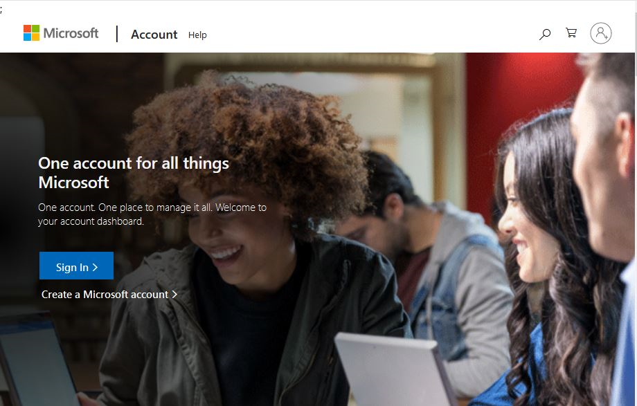
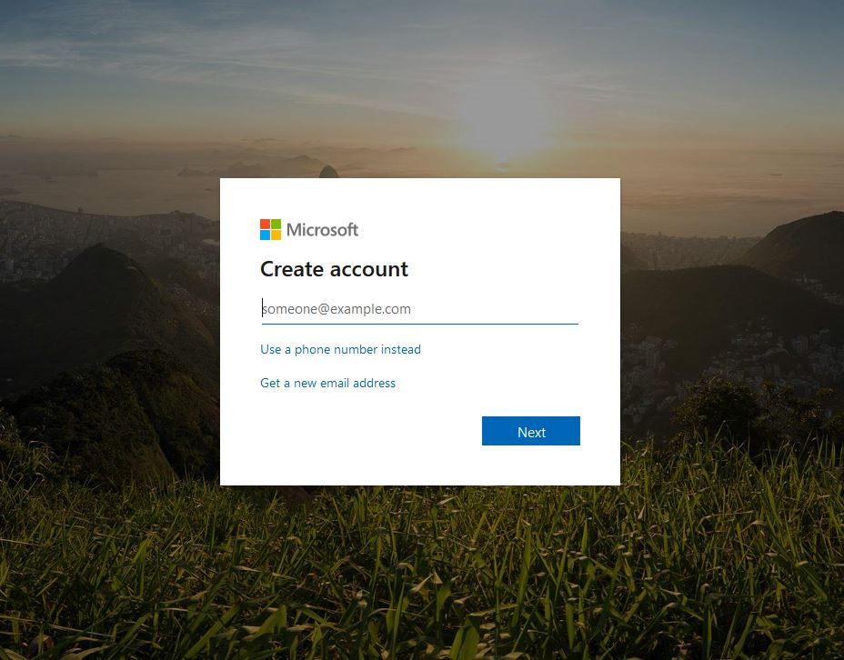
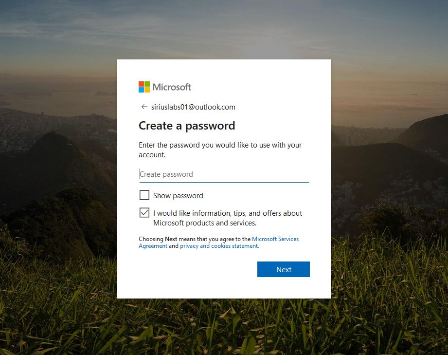
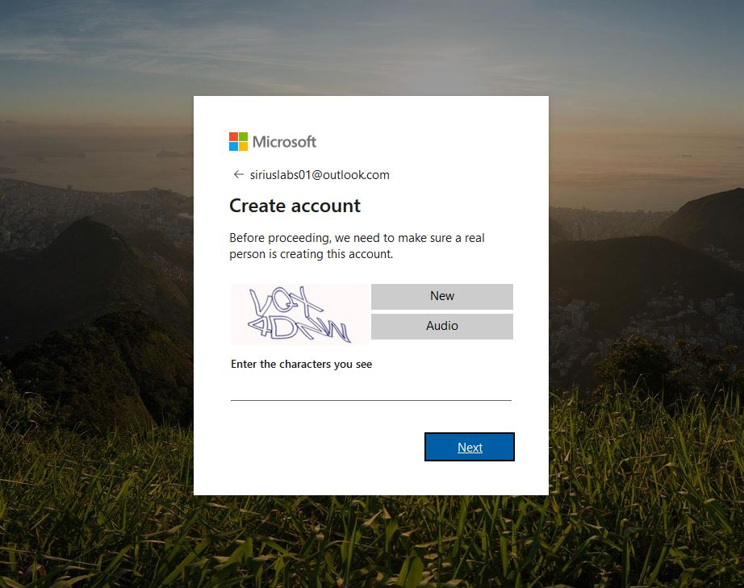
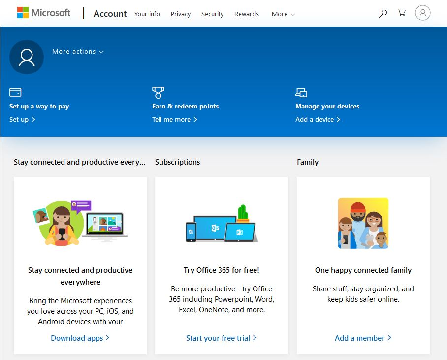
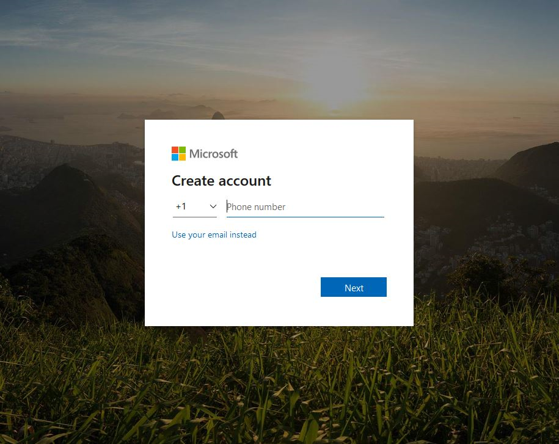
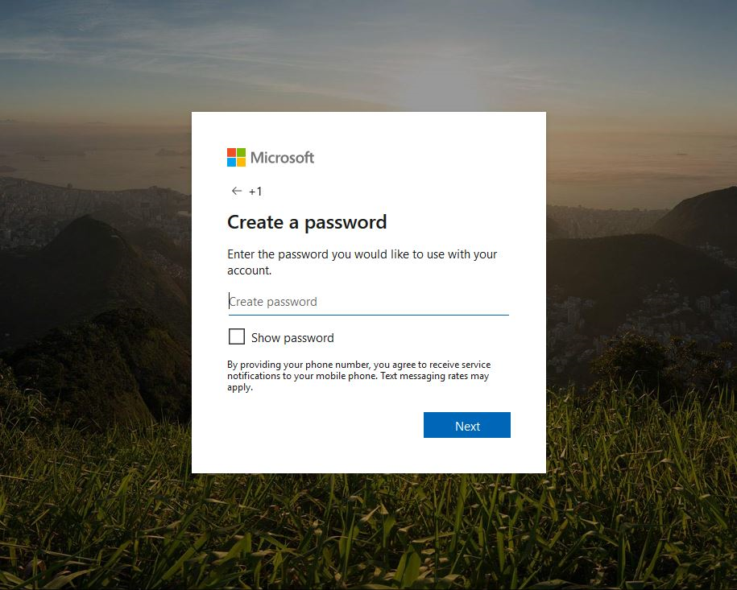
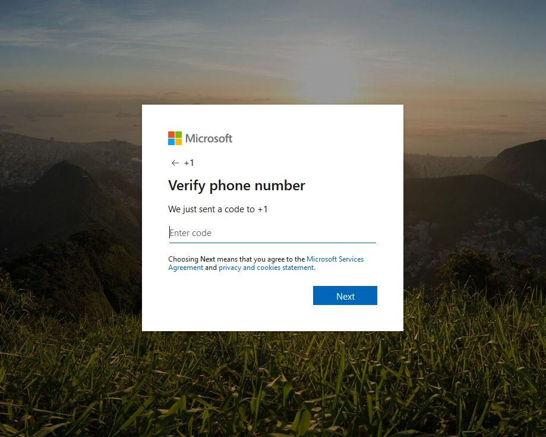
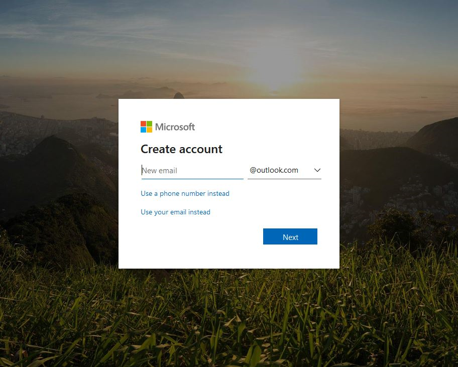

# Exercise - Create a free Microsoft account

* 10 minutes

You will be creating a new Microsoft Azure subscription, using an Azure Pass token (pass) provided to you for this session.

You will need a Microsoft account to redeem the pass for an Azure credit, and to create and manage the subscription.

Remember, the account is free.

**IMPORTANT:**
**It is strongly recommended that you create a new Microsoft account for this session.**

Please note the use of the pass is subject to the following Terms and Conditions:

* **DO NOT** redeem a pass with an email account that is attached to an EA, the pass will not work.
* Passes needs to be redeemed within 90-days of being received.
* Customer Live ID/Org ID will be limited to one concurrent Azure Pass Sponsorship at a time.
* Monetary credit can't be used toward third party services, premier support or Azure MarketPlace and cannot be added to existing subscriptions.
* If you add a payment instrument to the subscription and the subscription is active at the conclusion of the offer it will be converted to Pay-As-You-Go.
* Subscriptions are activated within minutes of the pass being redeemed.

## Creating a Microsoft Account

Creating a Microsoft account is as simple as the following, two step process:

1. Create the Microsoft account (with existing email address, a new email address, or a phone number)

2. Verify the email address or phone associated with the account

To proceed, you will need to choose one of the following three options, and complete the proceedure provided for that option, later in this guide:

1. **Use an existing personal email address** - You can use an existing personal email address (ex. Outlook, Gmail, Yahoo), not already associated with a Microsoft account, to create a new one.

2. **Use a phone number** - You can use an existing mobile phone number (that you have with you), not already associated with a Microsoft account, to create a new one.

3. **Get a new email address** - You can create a new Microsoft email account and Microsoft account together.

### First Option: Use an existing personal email address

1. Open a browser and navigate to: account.microsoft.com

    **Note:** It is recommended you close all browsers and open a new In-Private Browser session. Other log-ins can persist and cause errors during the account setup.

2. Click "Create a Microsoft account >" link to get started.

3. In the Create account dialog, do the following:

* Enter an existing personal email address (ex. Outlook, Gmail, Yahoo), not already associated with a Microsoft account **(securly store this email address for later use)**, and click "Next".

* Enter a password **(securly store this password for later use)**, and click "Next".

* Enter the verification code and click "Next" to create the account.

* Your browser will be redirected to the Microsoft accounts page.

### Second Option: Use a phone number

1. Open a browser and navigate to: account.microsoft.com

    **Note:** It is recommended you close all browsers and open a new In-Private Browser session. Other log-ins can persist and cause errors during the account setup.

2. Click "Create a Microsoft account >" link to get started.

3. In the Create account dialog, do the following:

* Click "Use a phone number instead", enter an existing mobile phone number (that you have with you), not already associated with a Microsoft account, and click "Next".

* Enter a password **(securly store this password for later use)**, and click "Next".

* Enter the Microsoft account security code you received on your mobile phone, in the verification form, and click "Next".

* Your browser will be redirected to the Microsoft accounts page.

### Third Option: Get a new email address

1. Open a browser and navigate to: account.microsoft.com

    **Note:** It is recommended you close all browsers and open a new In-Private Browser session. Other log-ins can persist and cause errors during the account setup.

2. Click "Create a Microsoft account >" link to get started.

3. In the Create account dialog, do the following:

* Click "Get a new email address" and your account login information and select “Sign In”.

* Enter a password **(securly store this password for later use)**, and click "Next".

* Enter the verification code and click "Next" to create the account.

* Your browser will be redirected to the Microsoft accounts page.

Congratulations! You have now successfully set up an Azure Pass account, and should be on the Azure portal home page.
