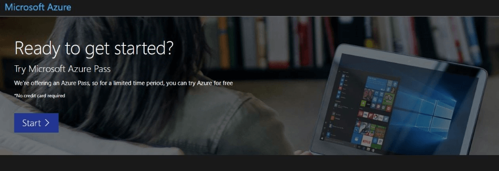
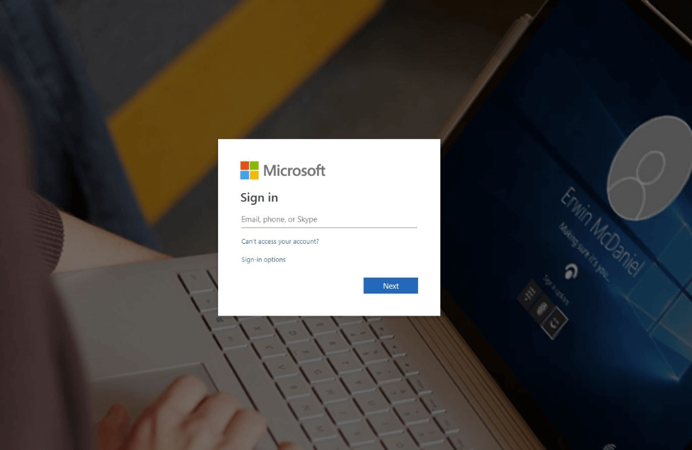
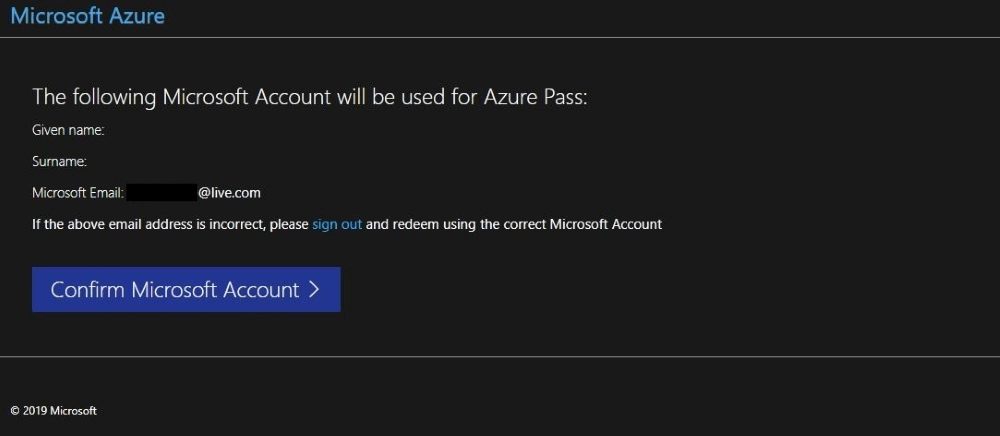
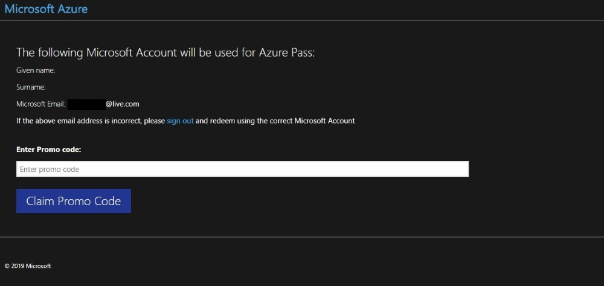
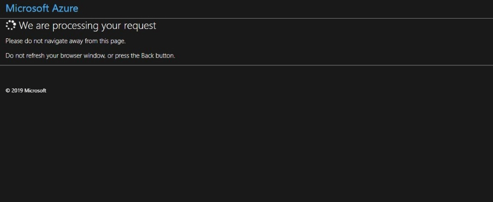
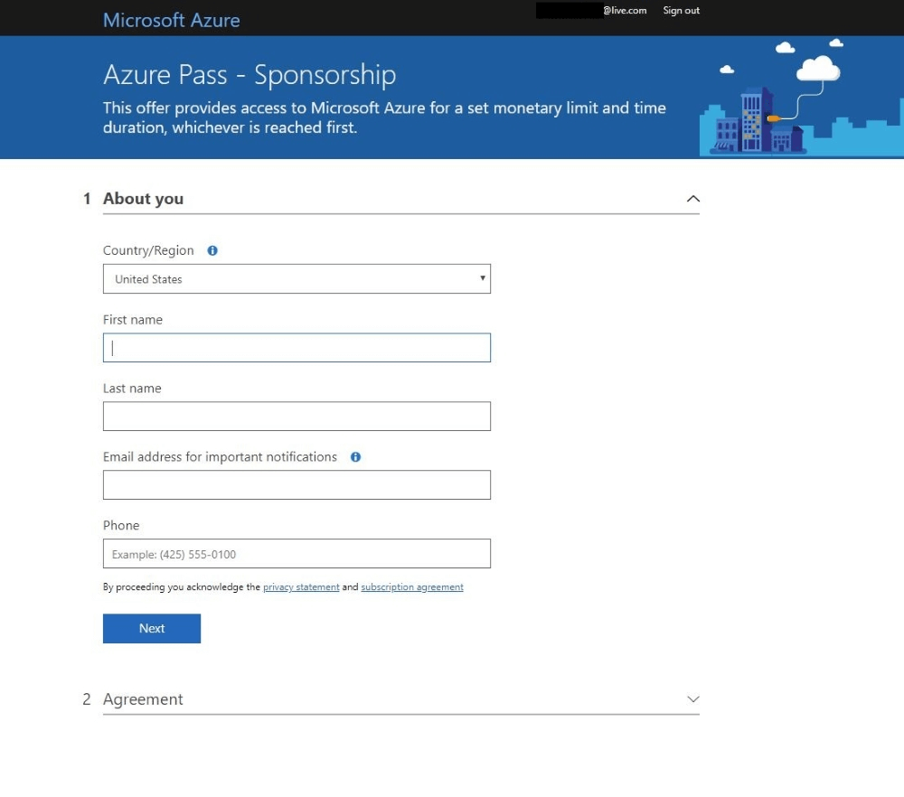
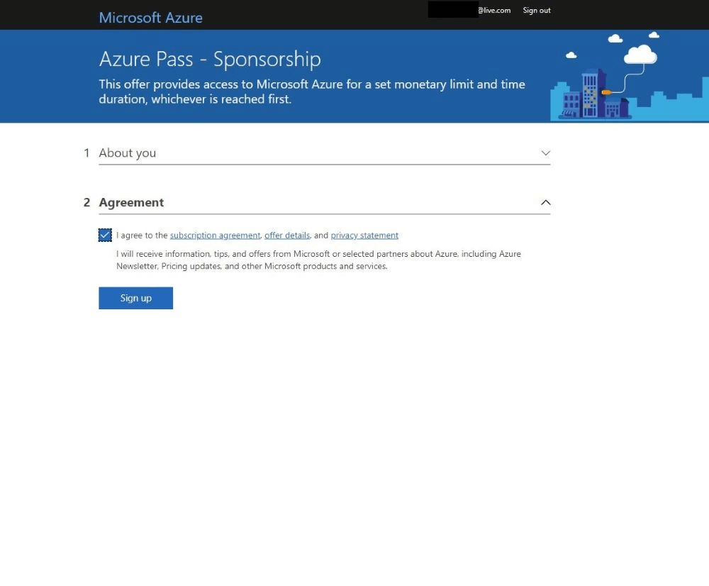
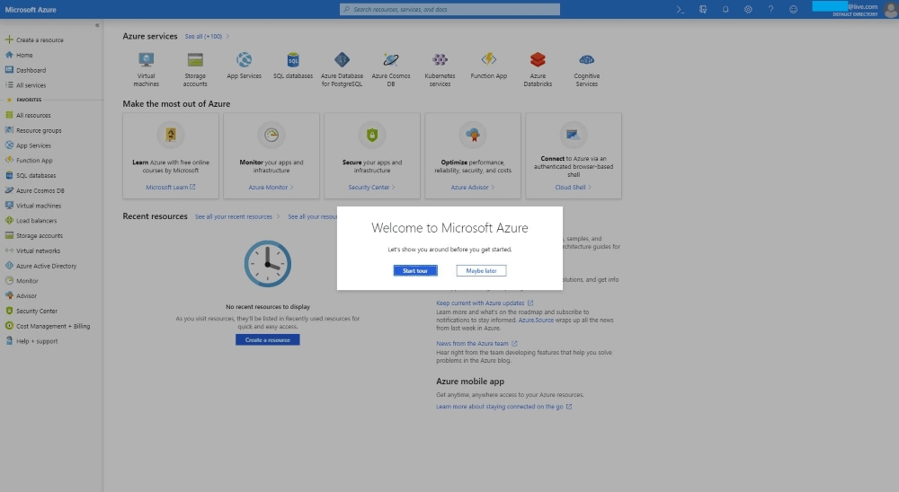

# Exercise - Create an Azure Pass subscription

* 10 minutes

You will be creating a new Microsoft Azure subscription, using an Azure Pass token (pass), provided to you for this session.

You will need the **new Microsoft account email address and password from your previous lab**, to redeem the pass for an Azure credit, and to create and manage the subscription.

Remember, the account is free - you will not be charged for any services until you convert the account to a pay-as-you-go account.

**IMPORTANT:** Please note the use of the pass is subject to the following Terms and Conditions:

* **DO NOT** redeem a pass with an email account that is attached to an EA, the pass will not work.
* Passes needs to be redeemed within 90-days of being received.
* Customer Live ID/Org ID will be limited to one concurrent Azure Pass Sponsorship at a time.
* Monetary credit can't be used toward third party services, premier support or Azure MarketPlace and cannot be added to existing subscriptions.
* If you add a payment instrument to the subscription and the subscription is active at the conclusion of the offer it will be converted to Pay-As-You-Go.
* Subscriptions are activated within minutes of the pass being redeemed.

## Creating a Microsoft Azure Pass Subscription

### Creating an Azure Pass subscription is a two step process

1. Redeem your Azure Pass Promo Code

2. Activate your subscription

### First Step: Redeeming a Microsoft Azure Pass Promo Code

1. Open a browser and navigate to: www.microsoftazurepass.com

    **Note:** It is recommended you close all browsers and open a new In-Private Browser session. Other log-ins can persist and cause errors during the activation step.

2. Click the start button to get started.

3. Enter your account login information and select “Sign In”.

4. Click “Confirm” if the correct email address is listed.

5. Enter your promo code in the Promo code box and click “Claim Promo Code”.

6. It may take up to 5 minutes to process the redemption.

### Second Step: Activate your subscription

* When the redemption process is completed, it will redirect to the sign up page.

* Enter your account information and click “Next”.

* Click the agreement check box and click the Sign up button.

* It may take a few minutes to process the request.

* Your Azure subscription is ready

Congratulations! You have now successfully set up an Azure Pass account, and should be on the Azure portal home page.
