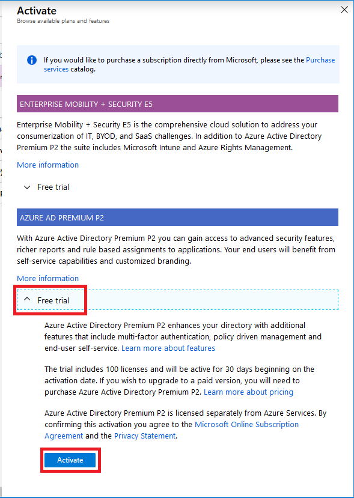

# Exercise - Secure access to resources

* 3 minutes

In the previous exercise, we enabled trial licenses, created a directory, created a user, and created a group to test our solution. In this unit, we will create our conditional access rule to require Azure Multi-Factor Authentication for the Azure portal.

## Login to the Azure Portal

1. Open the [Azure portal](https://portal.azure.com) in a browser.

2. Sign into Azure using the Microsoft account email address and password you created for this session.

## Enable conditional access-based Multi-Factor Authentication

Conditional access allows administrators to configure when they do or do not want something to happen. They can use multiple rules in parallel to grant or deny access to resources. Here's the rule that we need to create:

### When accessing the Azure portal - Require multi-factor authentication

The steps that follow will walk you through the process to create a conditional access rule to require users to perform multi-factor authentication when they access the Azure portal.

1. Browse to **Azure Active Directory**, and in the resulting blade locate and select **Conditional access** in the **Security** subsection.

    

2. Click the banner link titled **Create your own policies and target specific conditions ...**. This will open a new blade to active free trials.

3. Click to expand **Free trail** under **AZURE AD PREMIUM P2**, then click **Activate**.

    

4. Click the user icon in the upper left corner of the browser window, and click **Sign out**.

5. When the sign out completes, close the browser.

6. Open the [Azure portal](https://portal.azure.com) in a browser.

7. Sign into Azure using the Microsoft account email address and password you created for this session.

8. Browse to **Azure Active Directory**, and in the resulting blade locate and select **Conditional access** in the **Security** subsection.

    

9. Click the **New policy** button.

10. Name the policy **Require MFA for Azure portal**.

11. Under **Assignments**, on the **Include** tab, click **Select users and groups** radio button, then click to select the **Users and groups** checkbox, then click **Select** to open the next blade.

12. Select the group that we created in the previous unit, **CA-MFA-AzurePortal**, then click the **Select** button at the bottom. This will close the selection blade.

13. Click the **Done** button to complete this step and close the blade. You should once again see the new policy blade you opened in the second step above.

14. Under **Assignments** select **Cloud apps** to open the next blade.

15. Click **Select apps** on the Include tab, and then **Select** below it. This will open the selection blade.

16. Select **Microsoft Azure Management**, and then the **Select** button at the bottom. This will close the selection blade.

17. Click the **Done** button to complete this step and close the blade. You should once again see the new policy blade you opened in the second step above.

18. Under **Access controls** select **Grant** to open the next blade.

19. Click **Grant access** and then **Require multi-factor authentication**. Click the **Select** button to complete this step and close the blade. You should once again see the new policy blade you opened in the second step above.

20. Set **Enable policy** to **On**.

21. Click **Create**. If the **Create** button is not enabled, review the previous steps to ensure you've completed them all correctly.

In this unit, you learned how to create a conditional access rule for a previously defined group and/or user(s). The rule requires Multi-Factor Authentication when accessing the Azure portal.
