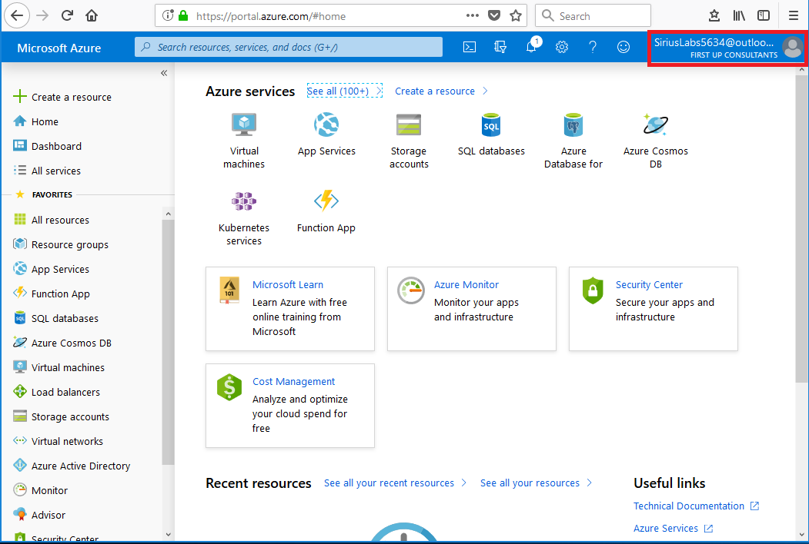
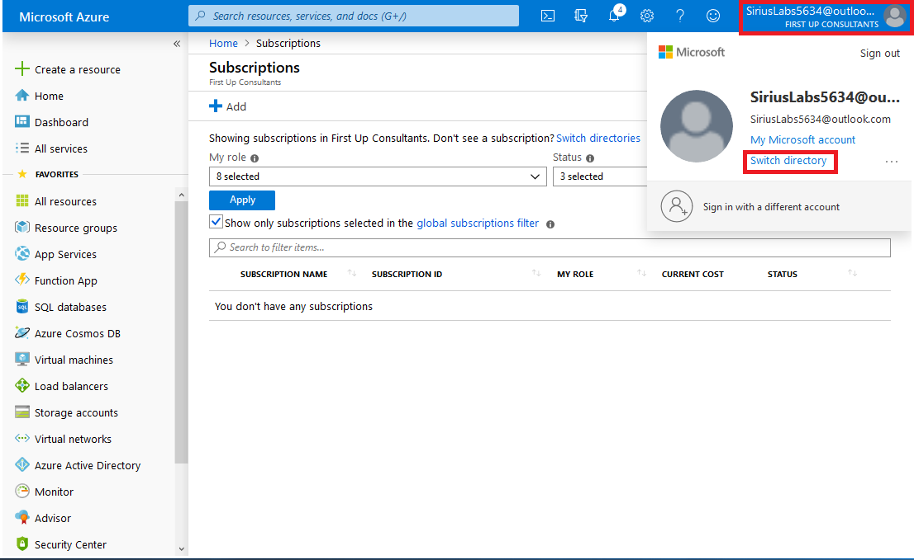
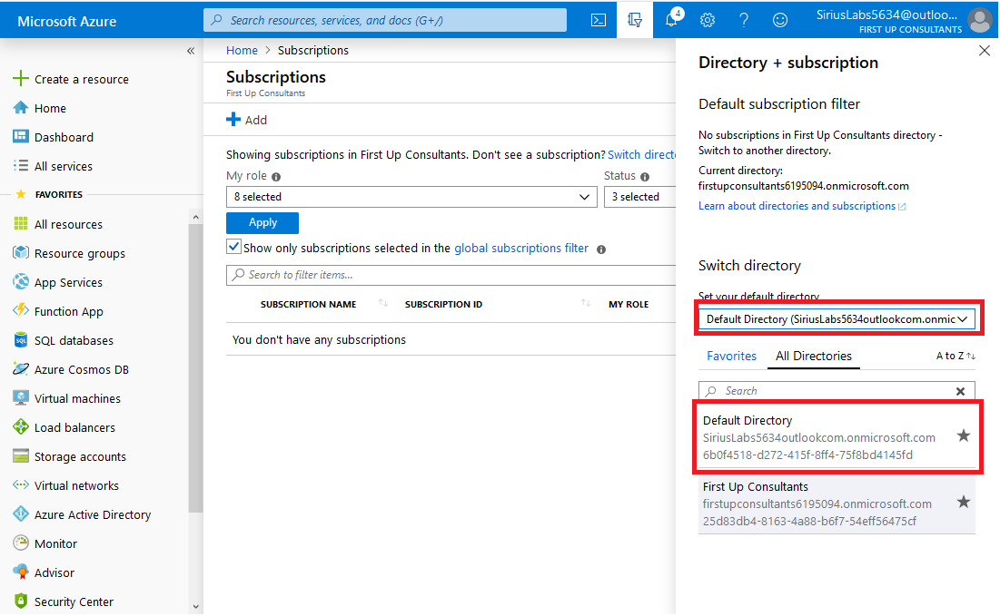
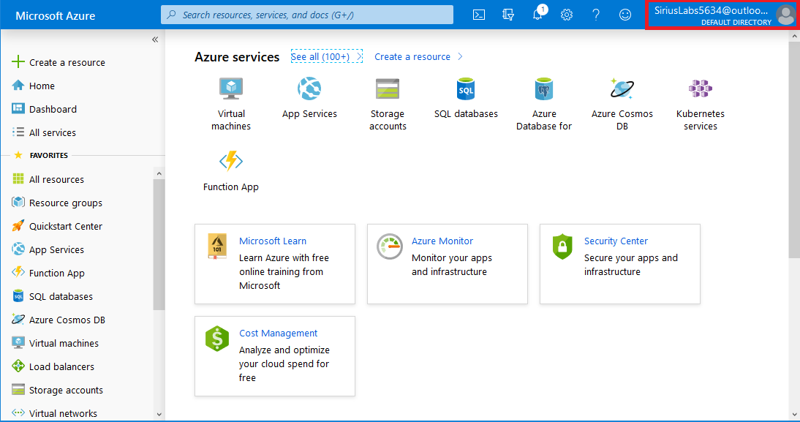

# Exercise - Test access to resources

* 5 minutes

In the previous exercises, we created a directory, created a user and group, and then created a conditional access rule that requires Azure Multi-Factor Authentication when accessing the Azure portal. Now, we'll test if we can access our resources.

## Test access to resources

You know that your users will sign in and access all their SaaS applications using the MyApps portal, so this is what we'll test.

1. Open an **InPrivate browser window**.

2. Browse to [https://myapps.microsoft.com](https://myapps.microsoft.com).

3. Sign in as the user that you created in the previous lab.

    * Notice that you're signed in to the portal without requiring Multi-Factor Authentication.

4. If this is the first time logging in as this user, you may be asked to change the password. If so, complete the password change and make a note of the password so you can use it later when testing.

5. In the same browser window, browse to [https://portal.azure.com](https://portal.azure.com).

    * Notice that you're now required to provide more information to keep your account secure. This interrupt is Azure Multi-Factor Authentication kicking in because of the conditional access policy we created.

6. Stop at this point and close the **InPrivate browser window**.

## Switch the Current Azure Active Directory Instance

After closing the **InPrivate browser window**, return to the browser window you have open to the Azure Portal. This session should be logged in as the Microsoft account (email address) you created for this session, and currently managing the Azure Active Directory instance you created in the previous labs.

If you closed the browser window you had open to the Azure portal, complete the following steps to login:

1. Open the [Azure portal](https://portal.azure.com) in a browser.

2. Sign into Azure using the Microsoft account email address and password you created for this session.

    This session should be logged in as the Microsoft account (email address) you created for this session, and currently managing the Azure Active Directory instance you created in the previous labs.

    

### Switch the directory

You will now switch your browser to manage your original lab Azure Active Directory.

1. In the upper right corner of the browser window, click the **User Icon**, then click **Switch directory**.

    

2. Change the **Set your default directory** dropdown list to the **Default Directory** and click on **Defaul Directory** button below.

    

3. In the upper right corner navigation pane, review the **User Icon** and confirm you are now managing the **Default Directory**.

    

In this lab you learned to test conditional access settings and switch between azure active directory instances.
