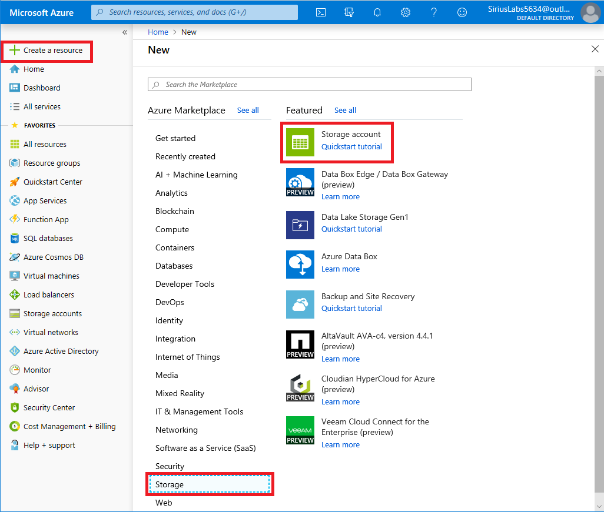
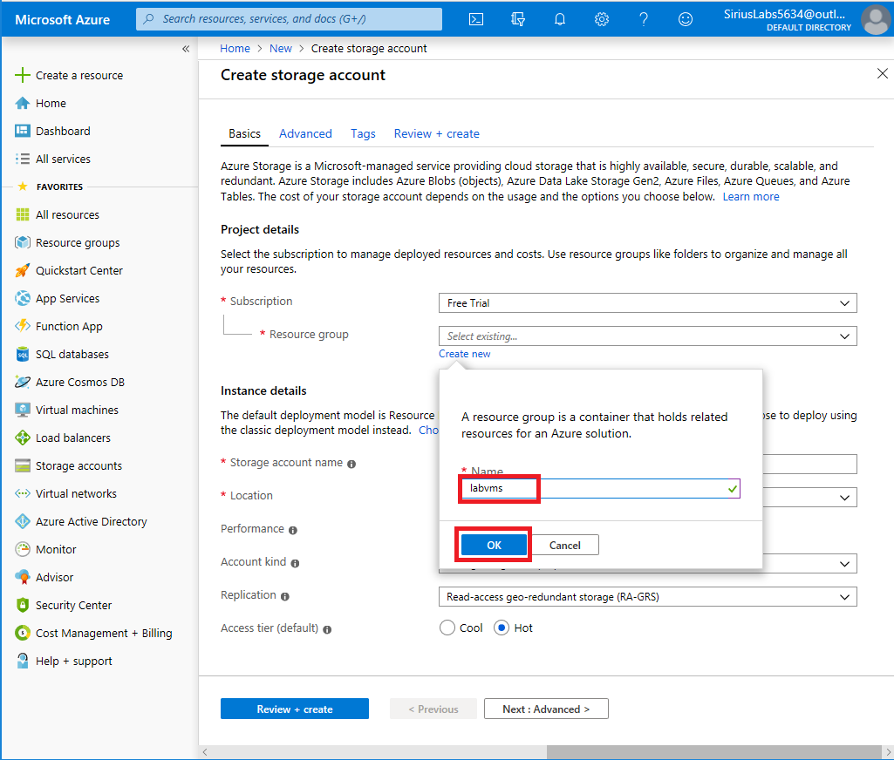
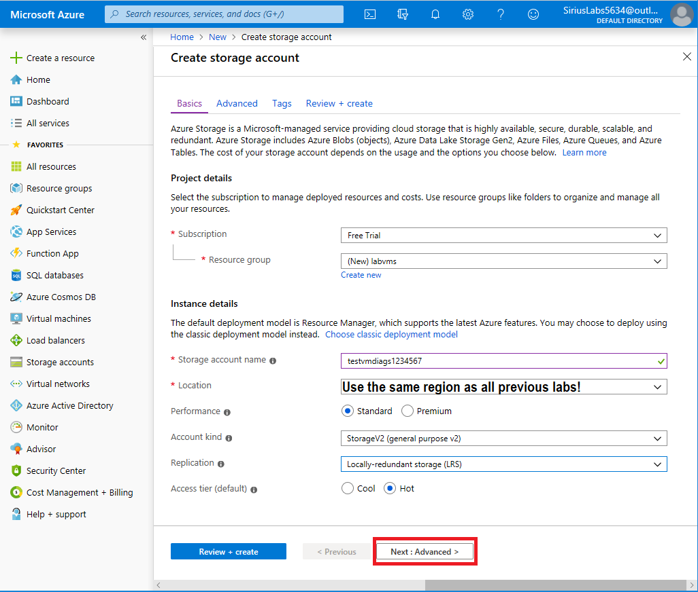
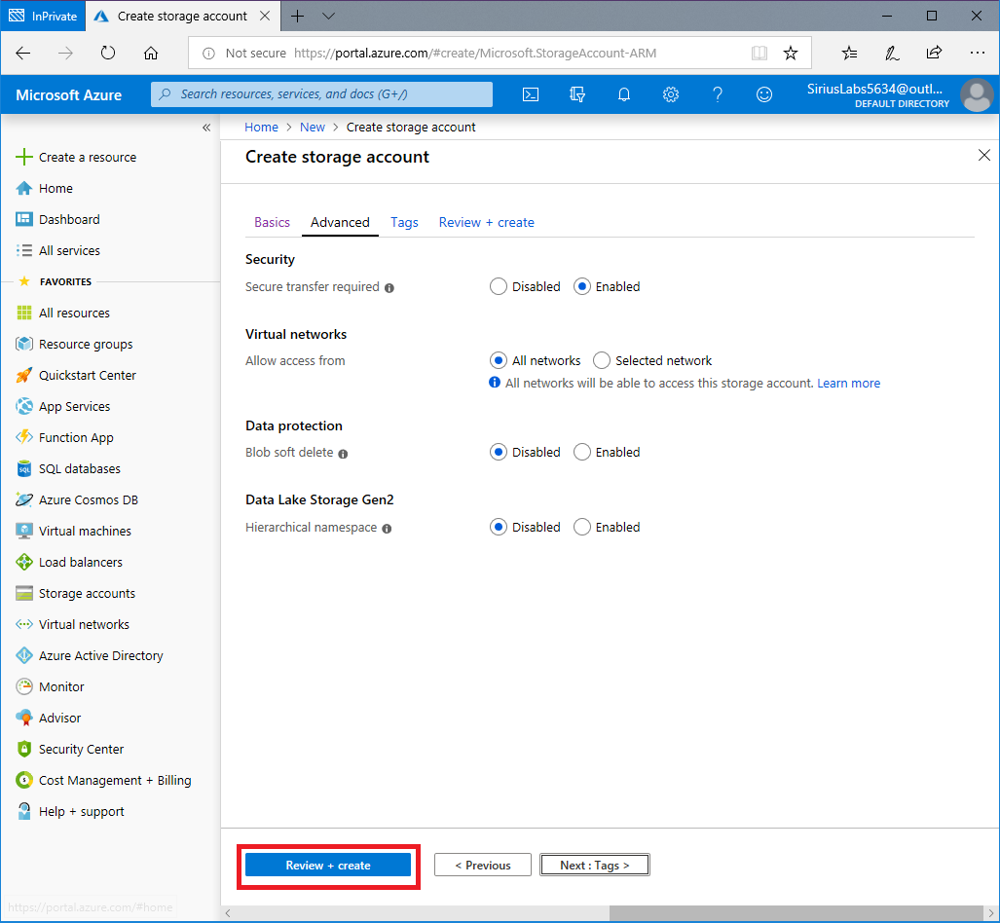
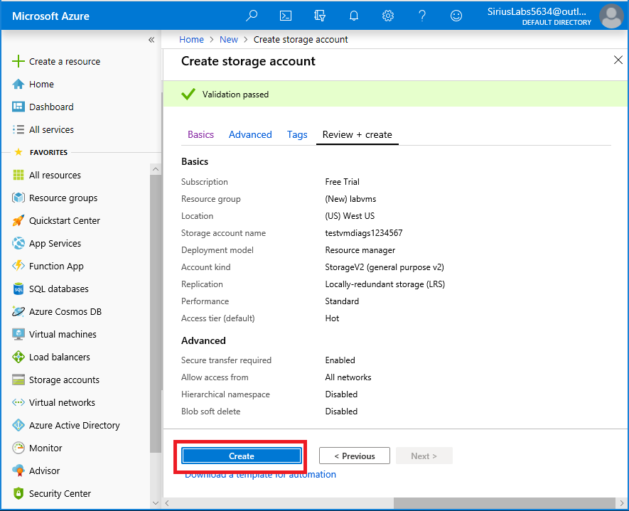
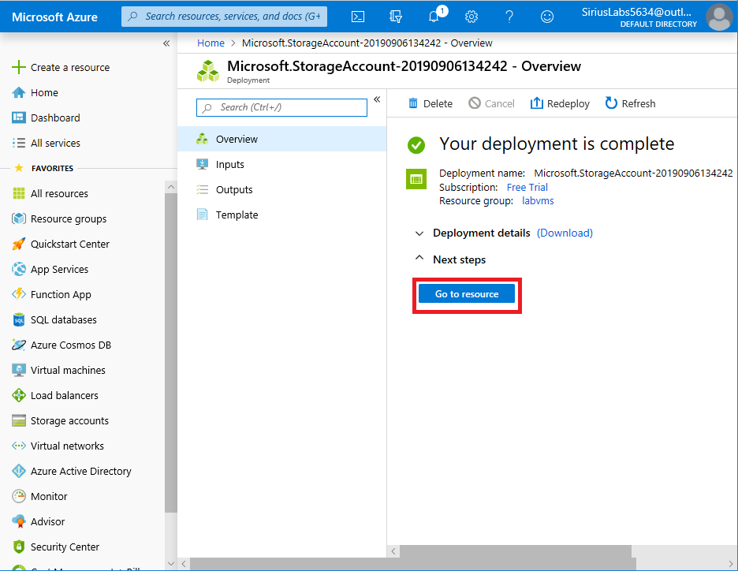

# Exercise - Create a storage account using the Azure portal

* 7 minutes

In this lab, you'll use the Azure portal to create a storage account that we will use in later labs to store VM boot diagnostics data.

## Login to the Azure Portal

1. Open the [Azure portal](https://portal.azure.com) in a browser.

2. Sign into Azure using the Microsoft account email address and password you created for this session.

## Use the Azure portal to create a storage account

1. In the top left of the Azure portal, select **Create a resource**.

2. In the selection panel that appears, select **Storage**.

3. On the right side of that pane, select **Storage account**.

    

### Configure the basic options

1. The **Subscription** should be set to the subscription you created for this session.

2. Click "Create new" under **Resource Group** and enter the name as _labvms_, and click **OK**.

    

3. Enter the **Storage account name** as _testvmdiagsXXXXXXX_ where _XXXXXXX_ is a word or number you add to give the account a unique name.

    The name will be used to generate the public URL used to access the data in the account. The name must be unique across all existing storage account names in Azure. Names must be 3 to 24 characters long and can contain only lowercase letters and numbers.

4. Select a **Location** close to you, from the list. Use the same **Location** (region), as you have for all previous labs.

5. Select _Standard_ for the **Performance** option.

    This decides the type of disk storage used to hold the data in the Storage account. Standard uses traditional hard disks, and Premium uses solid-state drives (SSD) for faster access. VM diagnostics data doesn't require high performance storage. This wouldn't be cost effective.

6. Select _StorageV2 (general purpose v2)_ for the **Account kind**.

    This provides access to the latest features and pricing. In particular, Blob storage accounts have more options available with this account type.

7. Select _Locally-redundant storage (LRS)_ for the **Replication** option.

    Data in Azure storage accounts are always replicated to ensure high availability - this option lets you choose how far away the replication occurs to match your durability requirements. In our case, the VM diagnostic data is not important. As a result, there is little value to paying extra for global redundancy.

8. Verify that the **Access tier** is set to _Hot_.

    This setting is only used for Blob storage. The **Hot Access Tier** is ideal for frequently accessed data, and the **Cool Access Tier** is better for infrequently accessed data. Note that this only sets the _default_ value - when you create a Blob, you can set a different value for the data. In our case, we want the videos to load quickly, so you'll use the high-performance option for your blobs.

The following screenshot shows the completed settings for the **Basics** tab. Note that the resource group, subscription, and name will have different values.

### Configure the advanced options

1. Click the **Next: Advanced >** button to move to the **Advanced** tab, or select the **Advanced** tab at the top of the screen.

2. Verify that **Secure transfer required** is set to _Enabled_.

    The **Secure transfer required** setting controls whether **HTTP** can be used for the REST APIs used to access data in the Storage account. Setting this option to _Enabled_ will force all clients to use SSL (**HTTPS**). Most of the time you'll want to set this to _Enabled_ as using HTTPS over the network is considered a best practice.

    **Warning**

    If this option is enabled, it will enforce some additional restrictions. Azure files service connections without encryption will fail, including scenarios using SMB 2.1 or 3.0 on Linux. Because Azure storage doesn’t support SSL for custom domain names, this option cannot be used with a custom domain name.

3. Set the **Virtual networks** option to _All networks_.

    This option allows you to isolate the storage account on an Azure virtual network.

4. Leave the **Blob Soft delete** option set to _Disabled_.

    Soft delete lets you recover your blob data in many cases where blobs or blob snapshots are deleted accidentally or overwritten.

5. Leave the **Data Lake Storage Gen2** option as _Disabled_.

    This is for big-data applications that aren't relevant to this module.

The following screenshot shows the completed settings for the **Advanced** tab.

### Create

1. You can explore the **Tags** settings if you like.

    This lets you associate key/value pairs to the account for your categorization and is a feature available to any Azure resource.

2. Click **Review + create** to review the settings.

    This will do a quick validation of your options to make sure all the required fields are selected. If there are issues, they'll be reported here.

    

3. Once you've reviewed the settings, click **Create** to provision the storage account.

It may take a few minutes to deploy the account.

### Verify

1. When the account creation is complete, the summary screen, click **Go to resource** to explore the new account properties.

    

2. Browse the various blades of the storage account to become familiar with the options.

3. Click the X in the upper right corner of the window to close the storage account properties.

Congratulations! You just created an Azure storage account, with settings driven by your business requirements.
