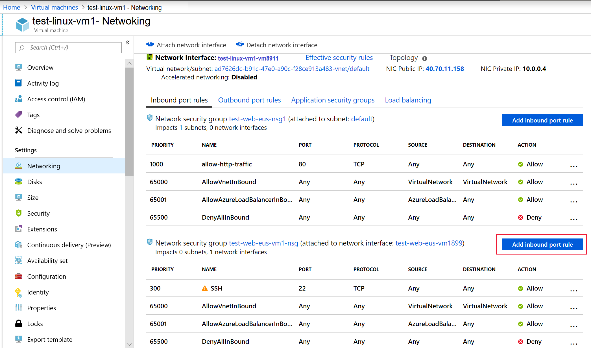
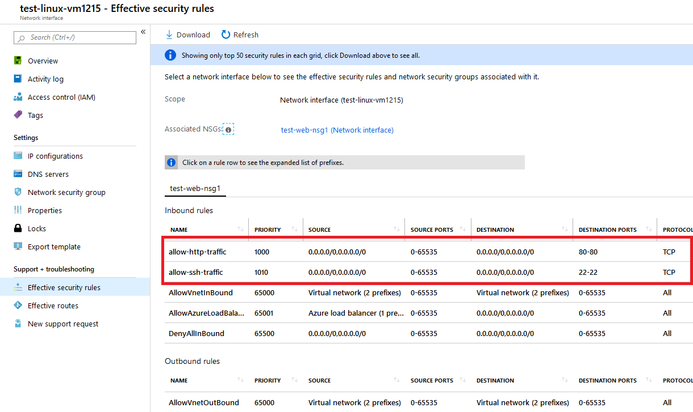

# Exercise - Configure network settings

* 10 minutes

Let's apply a network security group to our network, so that we only allow HTTP traffic through our server.

## Login to the Azure Portal

1. Open the [Azure portal](https://portal.azure.com) in a browser.

2. Sign into Azure using the Microsoft account email address and password you created for this session.

## Create a network security group

Azure should have created a security group for us because we indicated we wanted SSH access. But let's create a new security group, so you can walk through the entire process. This is particularly important if you decide to create your virtual network _before_ your VMs. As mentioned earlier, security groups are _optional_ and not necessarily created with the network.

1. In the [Azure portal](https://portal.azure.com/), click the **Create a resource** button in the left-corner sidebar to start a new resource creation.

2. Type **Network security group** into the filter box and select the matching item in the list.

3. Make sure the **Resource Manager** deployment model is selected and click **Create**.

4. Provide a **Name** for your security group. Again, naming conventions are a good idea here. Let's use **test-web-nsg1** for **Test Web Network Security Group #1**.

5. Select the proper **Subscription** and use your existing **Resource group** named **labvms**.

6. Finally, select the same **Location** as the VM / virtual network. This is important; you won't be able to apply this resource if it's in a different location.

7. Click **Create** to create the group.

## Add new inbound rules to our network security group

Deployment should complete quickly. When it's finished, we can add new rules to our security group:

1. Find the new security group resource and select it in the Azure portal.

2. On the overview page, you'll find that it has some default rules created to lock down the network.

    On the inbound side:

    * All incoming traffic from one VNet to another is allowed. This lets resources on the VNet talk to each other.
    * Azure Load Balancer **probe** requests to ensure the VM is alive.
    * All other inbound traffic is denied.

    On the outbound side:

    * All in-network traffic on the VNet is allowed.
    * All outbound traffic to the internet is permitted.
    * All other outbound traffic is denied.

    **Note**
    These default rules are set with high-priority values, which means that they get evaluated _last_. They cannot be changed or deleted, but you can _override_ them by creating more specific rules to match your traffic with a lower priority value.

3. Click the **Inbound security rules** section in the **Settings** panel for the security group.

### Add http inbound rules to our network security group

1. Click **+ Add** to add a new security rule.

    

    There are two ways to enter the information necessary for a security rule: basic and advanced. You can switch between them by clicking the button at the top of the **add** panel.

    

    The advanced mode provides the ability to customize the rule completely. However, if you need to configure a known protocol, the basic mode is a bit easier to work with.

2. Switch to the **Advanced** mode.

3. Add the information for our HTTP rule:

    * Set the **Service** to be HTTP. This will set your port range up for you.
    * Set the **Priority** to **1000**. It has to be a lower number than the default **Deny** rule. You can start the range at any value, but it's recommended that you give yourself some space in case an exception needs to be created later.
    * Give the rule a name; we'll use **allow-http-traffic**.
    * Give the rule a description.

4. Switch between the **Advanced** and **Basic**  modes. Notice that our settings are still present. We can use these panels to create more fine-grained settings. In particular, we would likely restrict the **Source** to be a specific IP address or range of IP addresses specific to the cameras. Leave the setting as **Any**, so you can test the rule.

5. Click **Add** to create the rule. This will update the list of inbound rules - notice they are in priority order, which is how they will be examined.

### Add ssh inbound rules to our network security group

1. Click **+ Add** to add a new security rule.

2. Switch to the **Advanced** mode.

3. Add the information for our SSH rule:

    * Set the **Service** to be SSH. This will set your port range up for you.
    * Set the **Priority** to **1010**.
    * Give the rule a name; we'll use **allow-ssh-traffic**.
    * Give the rule a description.

4. Click **Add** to create the rule. This will update the list of inbound rules - notice they are in priority order, which is how they will be examined.

    

## Apply the security group

Recall that we can apply the security group to a network interface to guard a single VM or to a subnet where it would apply to any resources on that subnet. The latter approach tends to be the most common, but we are going to replace the NSG assigned to the VM. We could get to this resource in Azure through either the virtual network resource or indirectly through the VM that is using the virtual network.

1. Navigate to the **Overview** panel for the virtual machine named _test-linux-vm1_. You can find the VM under **All Resources**.

2. Select the **Networking** item in the **Settings** section.

3. In the networking properties, you will find information about the networking applied to the VM, including the **Network Interface**. This is a clickable link to get to the resource. Click it to open the network interface.

4. In the **Settings** section, select the **Network security group** item, and click **Edit**.

5. Click the **Network security group** entry.

6. Select your new security group: **test-web-nsg1**. There should be another group here as well that was created with the VM.

7. Click **Save** to save the change. It will take a minute to apply to the network.

## Verify the rules

Let's validate the change:

1. Switch back to the **Overview** panel for the virtual machine. You can find the VM under **All Resources**.

2. Select the **Networking** item in the **Settings** section.

3. In the network interface details, there is a link for **Effective security rules** that will quickly show you how rules are going to be evaluated. Click the link to open the analysis and make sure you see your new rules.

    

4. Of course, the best way to validate it's all working is to hit our server with an HTTP request. It should now work.

    

**Warning** -
Always make sure to lock down ports used for administrative access. An even better approach is to create a VPN to link the virtual network to your private network and only allow RDP or SSH requests from that address range. You can also change the port used by SSH to be something other than the default. Keep in mind that changing ports is not sufficient to stop attacks. It simply makes it a little harder to discover.

Congratulations! With a few steps, you deployed a network security group to a VM that runs Linux.
