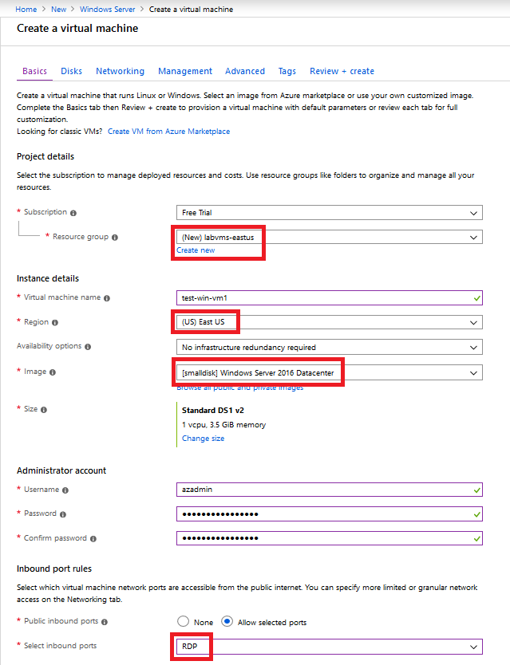
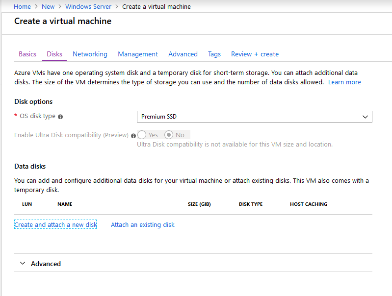
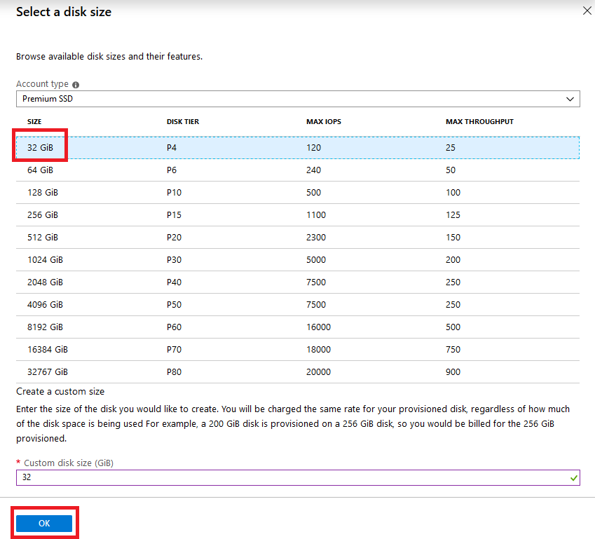
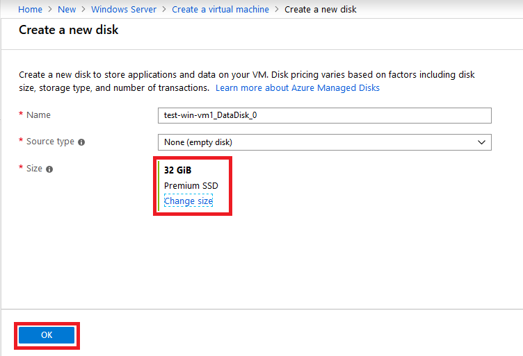
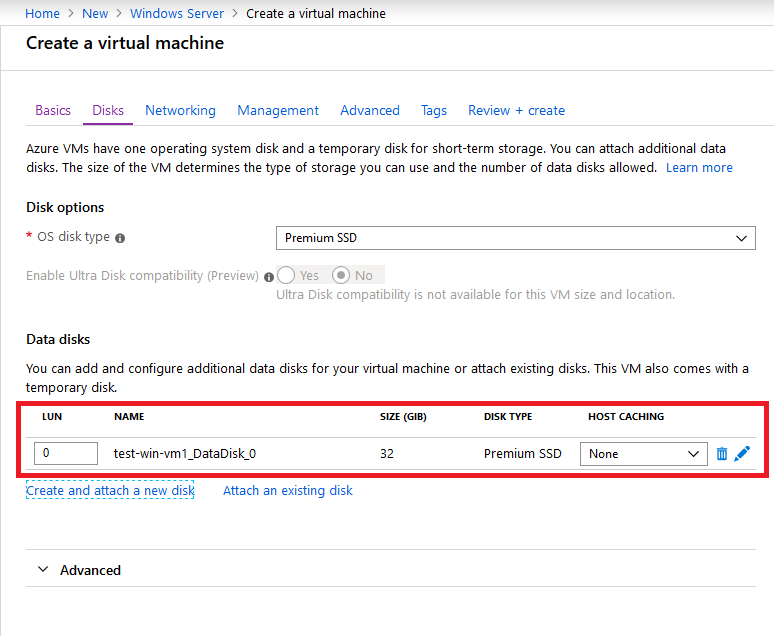

# Exercise - Create a Windows virtual machine

* 10 minutes

In this lab you will create a new Windows VM and add a data disk to it, to make it ready for production. This VM will be configured as an FTP server, and will host a third-party application.

## Login to the Azure Portal

1. Open the [Azure portal](https://portal.azure.com) in a browser.

2. Sign into Azure using the Microsoft account email address and password you created for this session.

## Create a new Windows virtual machine

We can create Windows VMs with the Azure portal, Azure CLI, or Azure PowerShell. The easiest approach is the portal because it walks you through the required information and provides hints and helpful messages during the creation of the VM.

1. Click **Create a resource** in the upper left corner of the Azure portal.

2. In the search box, enter **Windows Server 2016 Datacenter** and then click on the link with the same title in the presented list.

    

3. There are several Windows Server versions we can select from to create our VM. In the _Windows Server_ image overview panel, click on the **Select a software plan** dropdown list and find the **[smalldisk] Windows Server 2016 Datacenter** option.

    

4. Click the **Create** button to start configuring the VM.

## Configure the VM settings

The VM creation experience in the portal is presented in a "wizard" format to walk you through all the configuration areas for the VM. Clicking the "Next" button will take you to the next configurable section. However, you can move between the sections at will with the tabs running across the top that identify each section.

Once you fill in all the required options (identified with red stars), you can skip the remainder of the wizard experience and start creating the VM through the **Review + Create** button at the bottom.

We'll start with the **Basics** section.

### Configure basic VM settings

**Note**
As you change settings and tab out of each free-text field, Azure will validate each value automatically and place a green check mark next to it when it's good. You can hover over error indicators to get more information on issues it discovers.

1. Select the **Subscription** that should be billed for VM hours.

2. For **Resource group**, choose **labvms** (created in a previous lab), or create a new one.

3. In the **INSTANCE DETAILS** section, enter **test-win-vm1** for the name of the VM.

    * It's best practice to standardize your resource names so you can easily identify their purpose. Windows VM names are a bit limited - they must be between 1 and 15 characters, cannot contain non-ASCII or special characters, and must be unique in the current resource group.

4. Select a **Region** close to you, from the list. Use the same region as you have for all previous labs.

5. Leave **Availability options** as "None". This option is used to ensure the VM is highly available by grouping multiple VMs together a set to deal with planned or unplanned maintenance events or outages.

6. Ensure the image is set to "Windows Server 2016 Datacenter". You can open the drop-down list to see all the options available.

7. The **Size** field is not directly editable and has a DS1 default size. Click the **Change size** link to explore other VM sizes. The resulting dialog allows you to filter based on # of CPUs, Name, and Disk Type. Select "Standard DS1 v2" (normally the default) when you are done. That will give the VM 1 CPU and 3.5 GB of memory.

    **Tip**
    You can also just slide the view to the left to get back to the VM settings as it opened a new window off to the right and slid the window over to view it.

8. In the **ADMINISTRATOR ACCOUNT** section, set the **Username** field to a username you will use to sign in to the VM.

9. In the **Password** field, enter a password that's at least 12 characters long. It must have three of the following: one lower case character, one uppercase character, one number, and one special character that is not '\' or '-'. Use something you will remember or write it down, you will need it later.

10. Confirm the **password**.

11. In the **INBOUND PORT RULES** section, open the list and choose _Allow selected ports_. Since this is a Windows VM, we want to be able to access the desktop using RDP. Scroll the list if necessary until you find RDP (3389) and select it. As the note in the UI indicates, we can also adjust the network ports after we create the VM.

    

## Configure Disks for the VM

1. Click **Next** to move to the Disks section.

    

2. Choose "Premium SSD" for the **OS disk type**.

3. Use managed disks so we don't have to work with storage accounts. You can flip the switch in the GUI to see the difference in information that Azure needs if you like.

### Create a data disk

Recall we will get an OS disk (C:) and Temporary disk (D:). Let's add a data disk as well.

1. Click the **Create and attach a new disk** link in the **DATA DISKS** section.

    

2. You can take all the defaults: Premium SSD, 1023 GB, and None (empty disk); although notice that here is where we could use a snapshot, or Storage Blob to create a VHD.

3. Click **OK** to create the disk and go back to the **DATA DISKS** section.

4. There should now be a new disk in the first row.

    

## Configure the Network

1. Click **Next** to move to the Networking section.

2. Select the **Virtual network** and **Subnet** you create in the previous labs (do not select the Gateway subnet).

**Note**
If you do not select an existing Virtual network and Subnet, by default, Azure will create a new virtual network, and bind the network interface, and public IP for your VM to it. It's not trivial to change the networking options after the VM has been created so always double-check the network assignments on services you create in Azure.

## Configure Management

1. On the **Management** tab, under **Monitoring**, switch **Boot diagnostics** to **Off**.

    

## Finish configuring the VM and create the image

The rest of the options have reasonable defaults and there's no need to change any of them. You can explore the other tabs if you like. The individual options have an `(i)` icon next to them that will show a help bubble to explain the option. This is a great way to learn about the various options you can use to configure the VM.

1. Click the **Review + create** button at the bottom of the panel.

2. The system will validate your options and give you details about the VM being created.

3. Click **Create** to create and deploy the VM. The Azure dashboard will show the VM that's being deployed. This may take several minutes.

Congratulations! With a few steps, you deployed a VM that runs Windows.
