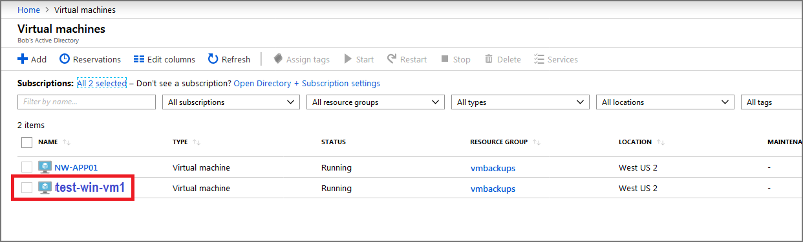
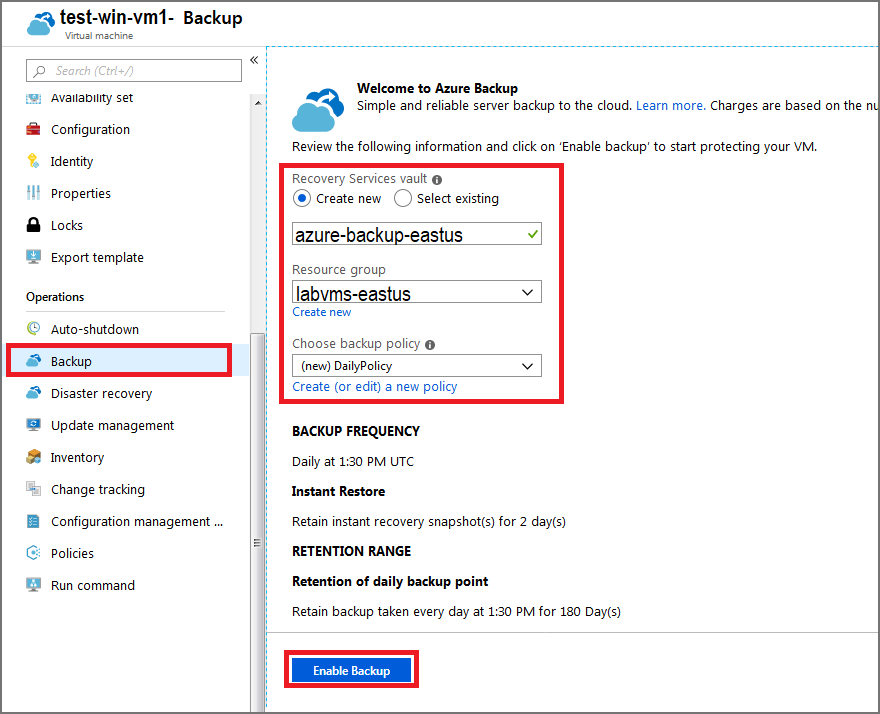
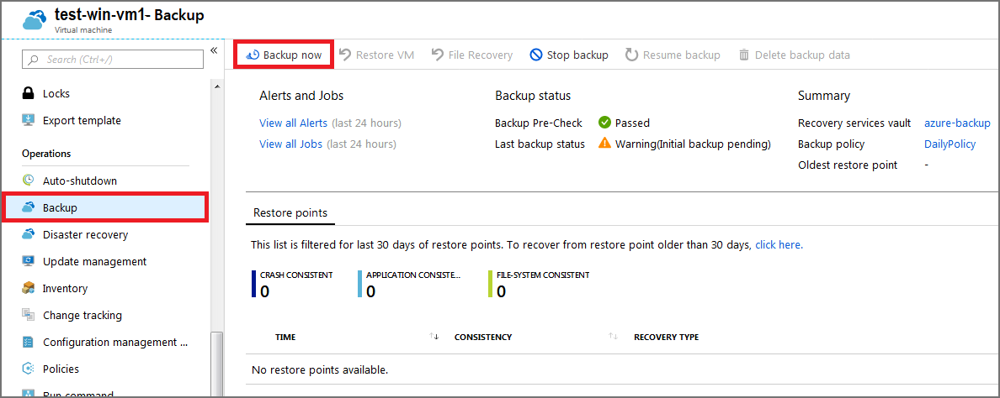
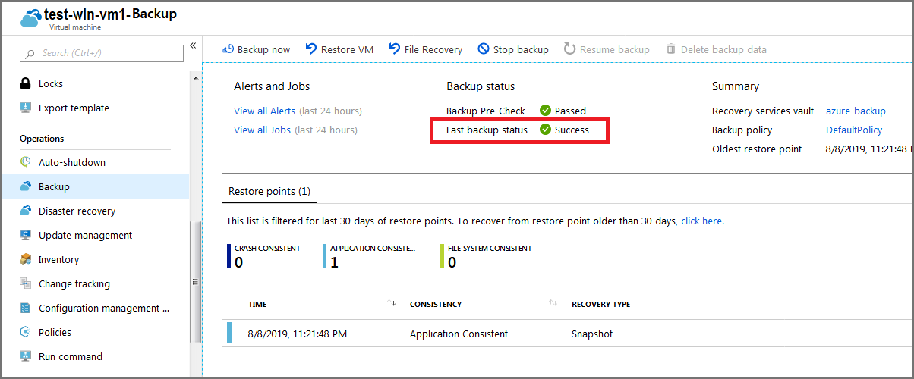
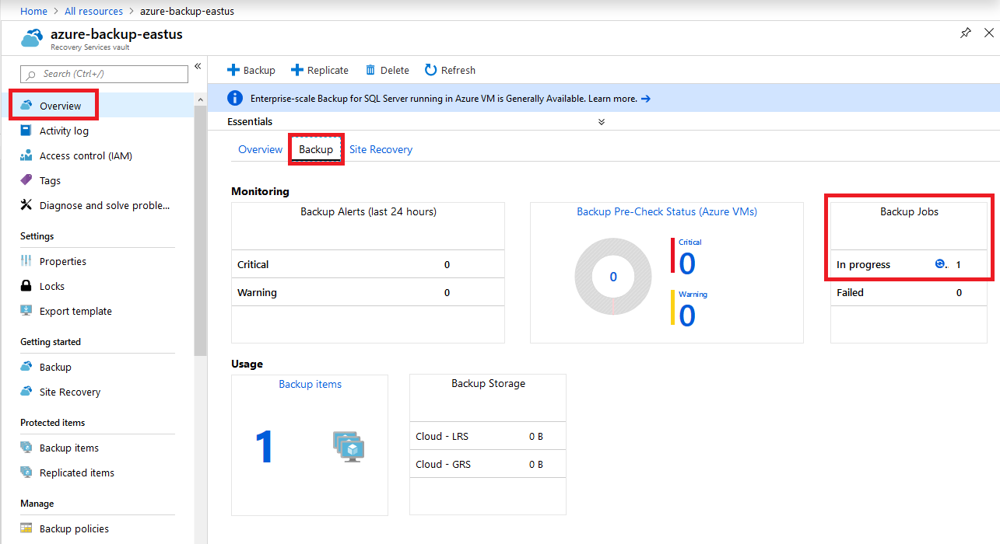
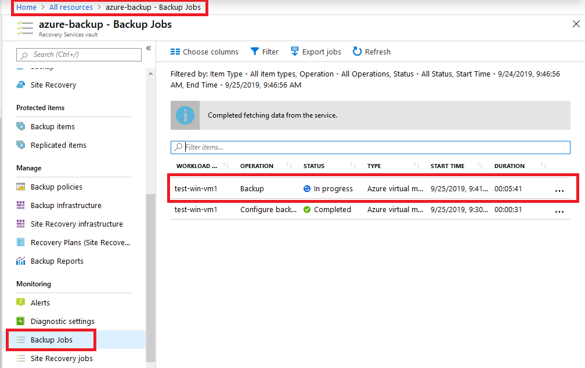

# Exercise - Backing up an Azure virtual machine

* 10 minutes

Your company is running a combination of Windows and Linux workloads, and you've been asked to prove Azure Backup is a good fit for both kinds of virtual machines. Using a combination of Azure CLI and the Azure portal, you're going protect both kinds of virtual machines with Azure Backup.

Azure Backup can be quickly enabled for virtual machines in Azure. You can enable Azure Backup from the portal, the Azure CLI, or with PowerShell commands.

In this exercise, you'll create a backup of a virtual machine, and monitor the job in the portal.

## Login to the Azure Portal

1. Open the [Azure portal](https://portal.azure.com) in a browser.

2. Sign into Azure using the Microsoft account email address and password you created for this session.

## Enable backup for a virtual machine using the Azure portal

1. Select **All Services** and then search for **Virtual Machines**. From the list, select **Virtual Machines**.

    

2. From the list, select the **test-win-vm1** virtual machine you created.

    

3. In the sidebar, scroll down to **Operations**, select **Backup**, and then use the following information to create a backup:

   **Recovery Services vault**
    * Select **Create new**, and type **azure-backup-eastus** for the name.

        **Note** - You will use **East US** for this lab, as future labs depend on it, so you will include this in the name.

    **Resource group**
    * Select the existing resource group named **labvms-eastus**.

        **Note** - You will use **East US** for this lab, as future labs depend on it, so you will use a resource group already created in a previous lab.

    **Choose a backup policy**

    * Select **(new) DailyPolicy**, which is a daily backup at 12:00 PM UTC, and a retention range of 180 days.

        

4. Select **Enable Backup**.

5. After the deployments completes, select **test-win-vm1** from the list of virtual machines.

6. The backup settings for the virtual machine can be accessed from the virtual machine menu by scrolling down to **Operations** and selecting **Backup**.

7. To perform the first backup for this server, select **Backup now**.

    

8. On the **Backup Now** page, select **OK**.

## Monitoring backups in the portal

### View the status of a backup for a single virtual machine

1. In the [Azure portal](https://portal.azure.com/), select **All resources** on the left side.

2. Select the **test-win-vm1** virtual machine.

3. Under **Operations**, select **Backup**.

    

    The **Last backup status** will display the current status of the backup.

### View the status of backups in the Recovery Service vault

1. In the [Azure portal](https://portal.azure.com/), select **All resources** on the left side.

2. Select the **azure-backup** Recovery Services vault.

3. Select the **Backup** tab on the **Overview** page to see a summary of all the backup items, storage being used, and the current status of any backup jobs.

    

4. Select the **Backup Jobs** under **Monitoring** to see a summary of all the backup jobs and their current status.

    

**Note** - It will take some time for the backup to complete. You can check back later to confirm the job completes.

Congratulations! With a few steps, you backed up a VM in Azure.
