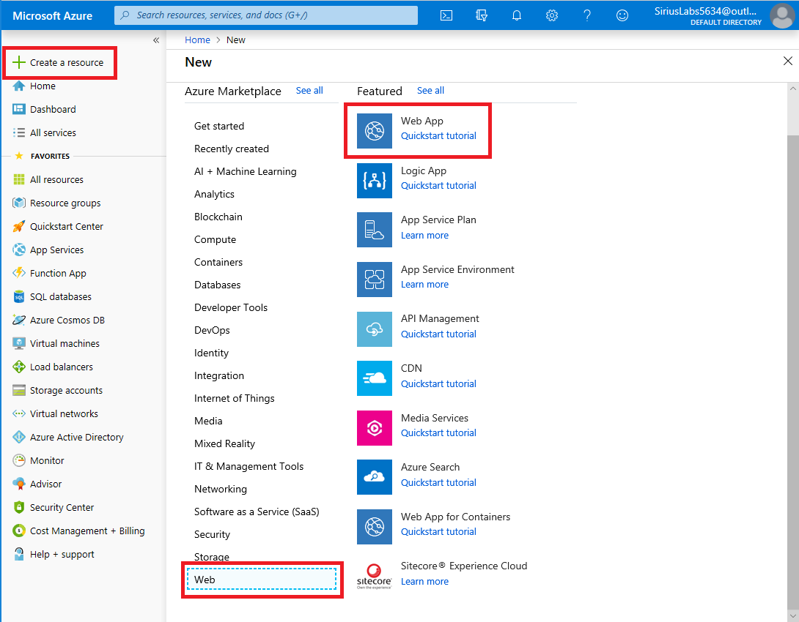
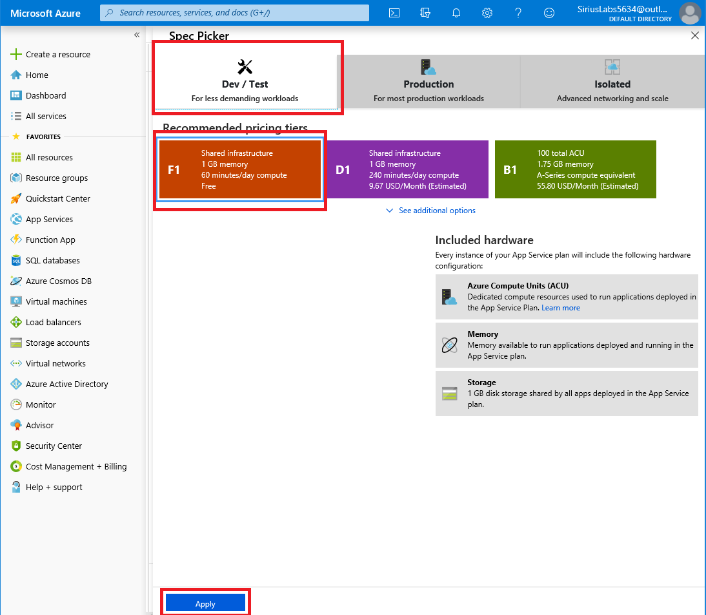
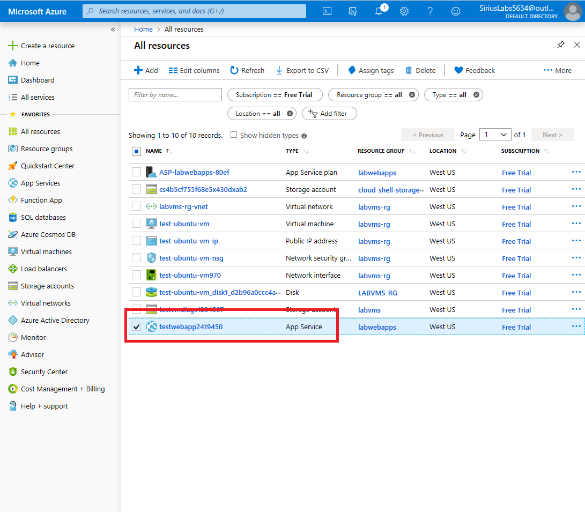
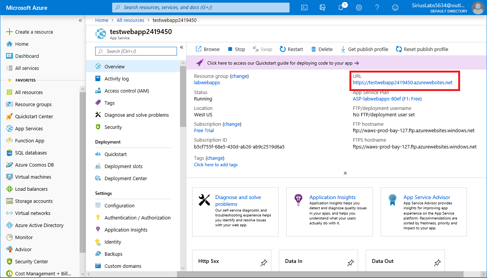
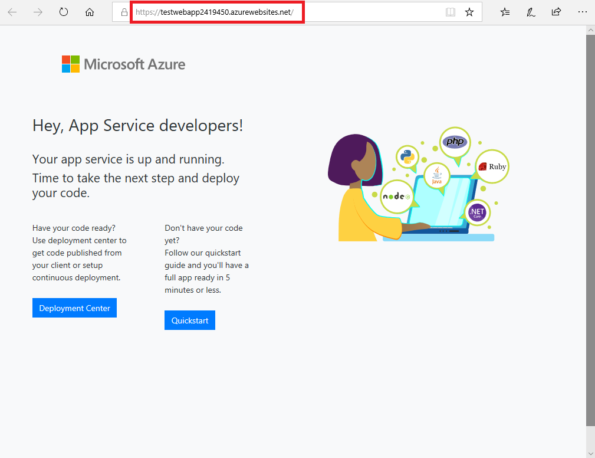

# Exercise - Create a web app in the Azure portal

* 10 minutes

In this lab, you will use the Azure portal to create a web app.

## Login to the Azure Portal

1. Open the [Azure portal](https://portal.azure.com) in a browser.

2. Sign into Azure using the Microsoft account email address and password you created for this session.

## Create a web app

1. Select the **Create a resource** link at the top of the left-hand navigation. Everything you create on Azure is a resource.

2. The portal navigates you to the **Marketplace** page. From here, you can search for the resource you want to create or select one of the popular resources that people create in the Azure portal.

3. Select **Web** > **Web App** to display the web app creation wizard.

    

### Configure the Basics options

1. The **Subscription** should be set to the subscription you created for this session.

2. Click "Create new" under **Resource Group** and enter the name as _labwebapps_, and click **OK**.

    

3. Enter the **Web App name** as _testwebappXXXXXXX_ where _XXXXXXX_ is a word or number you add to give the web app a unique name.

    This name will be part of the app's URL: _appname.azurewebsites.net_. The name you choose must be unique among all Azure web apps. Names must be 3 to 24 characters long and can contain only lowercase letters and numbers.

4. Select _Code_ for the **Publish** setting.

5. Select _.NET Core 2.2_ for the **Runtime stack**, from the list.

6. Select _Windows_ for the **Operating System**.

7. Select a **Region** close to you, from the list. Use the same **Region** (location), as you have for all previous labs.

8. Under **App Service Plan**, verify the default **Windows Plan (region)** is set to something similar to _(New) ASP-labwebapps-XXX_, where XXX is random string, to make the name unique.

9. Click "Change size" under **Sku and size**, then click the **Dev / Test** tab, then click to select the _F1_ pricing tier, and click **Apply**.

    

10. Review the **Basics** settings and values for accuracy, and if satified, click **Next: Monitoring >** to move to the **Monitoring** tab.

    The following screenshot shows the completed settings for the **Basics** tab. Note that the subscription, name, and Windows Plan will have different values.

    

### Configure the Monitoring options and Create the Web App

1. Select _No_ for **Enable Application Insights**.

    

2. Select **Review and Create** to navigate to the review page, then select **Create** to create the app.

    

**Note**

It can take a few seconds to get your web app created and ready for your use.

The portal will display the deployment page, where you can view the status of your deployment. Once the app is ready, navigate to the new app in the Azure portal:

1. Select the **All resources** menu on the left side navigation.

2. Select your Web App resource from the list. Make sure to select the web app, and not the App Service plan.

    

3. The portal displays the web app overview page.

    

4. To preview your new web app's default content, select its **URL** at the top right. The placeholder page that loads indicates that your web app is up and running and ready to receive deployment of your app's code.

    

Congratulations! You just created a Web App, in the Azure Portal.
