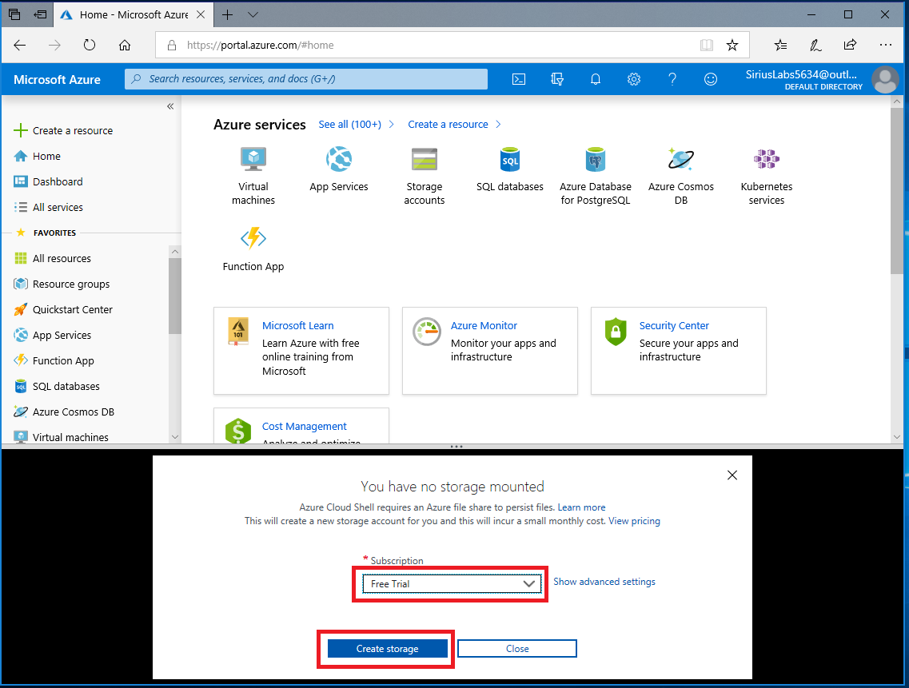
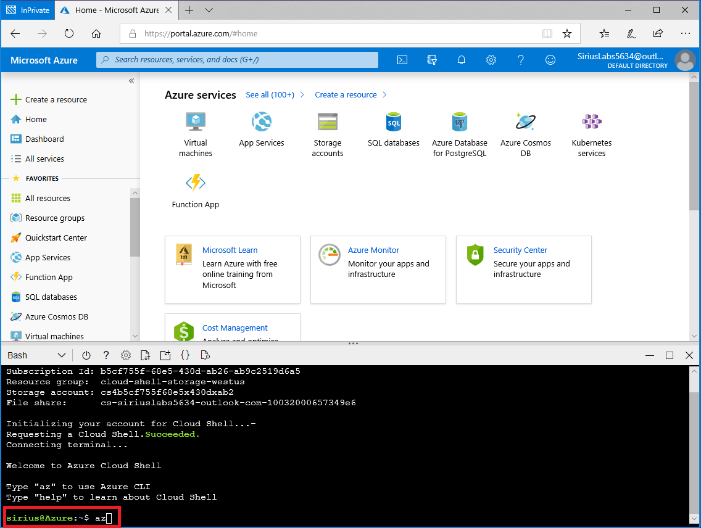
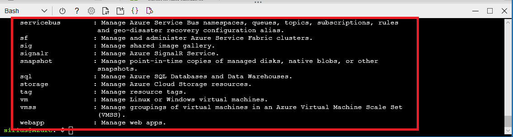

# Exercise - Write code to implement a web application

* 10 minutes

In this unit, you will use developer tools to create the Node.JS code for a starter web application.

## Login to the Azure Portal and Open Azure Cloud Shell in-line

1. Open the [Azure portal](https://portal.azure.com) in a browser.

2. Sign into Azure using the Microsoft account email address and password you created for this session.

3. Click the **Cloud Shell** icon in the toolbar to launch the in-line Cloud Shell window

4. If promoted, then click **Bash** in the window.

    

5. If prompted, select your subscription, and click **Create storage**.

    

6. To start the Azure CLI, enter the following command and press Enter.

        az

    

    You should see something like the following list of available commands:

    

## Create a new web project

To create a starter Node.js web application, we'll use Node Package Manager (`npm`) along with some basic JavaScript code to run the actual web page processing.

1. Run these commands in the Cloud Shell now to create a new `package.json` which will describe our Node.js application.

        cd ~
        mkdir helloworld
        cd helloworld
        npm init -y

    This will create a new `package.json` file in the current folder - you should see it in the current folder if you type `ls` in the terminal window. We will need a JavaScript file to run our website logic - since this is just a basic example, we will only need one file - `index.js`.

2. Use the following command in the terminal to create the file:

        touch index.js

    Now we have to make a few edits to both of our files.

3. Type the following command into the terminal to open an interactive editor.

        code .

4. Select the `package.json` file and make the following edits to the `scripts` section to use Node.js to launch the web app. You can also remove the `main` entry.

        {
        "name": "helloworld",
        ...
        "scripts": {
            "start": "node index.js"
        },
        ...
        }

5. Save the file using **_Ctrl+S_** on Windows and Linux, **_Command+S_** on macOS.

    **Important** - Whenever you paste or change code into a file in the editor, make sure to save afterwards using the "..." menu, or the accelerator key (**_Ctrl+S_** on Windows and Linux, **_Command+S_** on macOS).

6. Switch to the `index.js` file and add the following contents to it. This is a simple node program to always respond with "Hello World!" when any GET request is made to the server.

        var http = require('http');

        var server = http.createServer(function(request, response) {

            response.writeHead(200, { "Content-Type": "text/html" });
            response.end("<html><h1>Hello World!</h1></html>");

        });

        var port = process.env.PORT || 1337;
        server.listen(port);

        console.log("Server running at http://localhost:%d", port);

7. Save the file using **_Ctrl+S_** on Windows and Linux, or **_Command+S_** on macOS, and exit the editor. You can exit the editor through the "..." menu on the top right or through **_Ctrl+Q_**.

Congratulations! You just created the Node.JS code for a Web App, in the Azure Cloud Shell.
